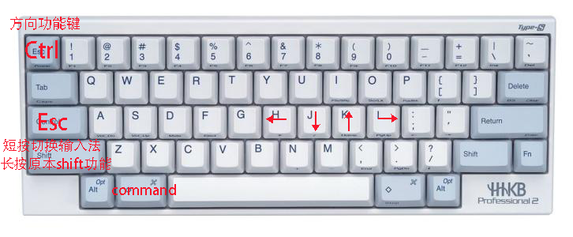

这里是我在 B 站上面录制的视频：https://www.bilibili.com/video/BV1Zg4y1v7fc/

# HHKB-Config
个人自用HHKB键盘键位设置/借助Karabiner软件来映射

如果不会弄可以直接下载然后替换掉`~/.config/karabiner/karabiner.json`

个人建议根据自己动需求然后自行修改自己习惯的键位

已经使用了Karabinker改建
所以键盘背面的按钮全部都是关闭状态

首先在karabine中启用Complex Modifications 启用其中的change right_command +hjkl to arrow keys
然后`~/.config/karabiner/karabiner.json`把里面的right_command改成left_control即可把最左边的按键+hjk编程方向键

自定义上下翻页，方便浏览文件，原本上下翻页使用到组合键的。

本人使用的是百度输入法，因为该输入法再屏幕上会有悬浮提示，sougou只有在上方状态栏,不是很合适我。

#### shift
- 短按：切换输入法
- 长按保持shift原本功能键

快速切换输入法的方式请看看我写到文档:https://github.com/itgoyo/Mac-Shift

如果想使用我的键位，详细请参考:`karabiner.json`文件 

### 注意
在使用百度输入法的时候要把百度输入法的 shift 中英文切换功能去掉，只保留百度的中文输入法功能，这样子不管什么时候就可以使用 shift 实现中英文切换了。

### 最后
最后看到右下角还有两个多余的按键，然后直接映射成了上下翻页键了，具体操作自行使用 Karabiner 来操作
